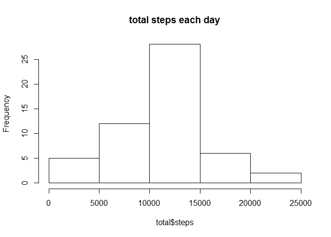
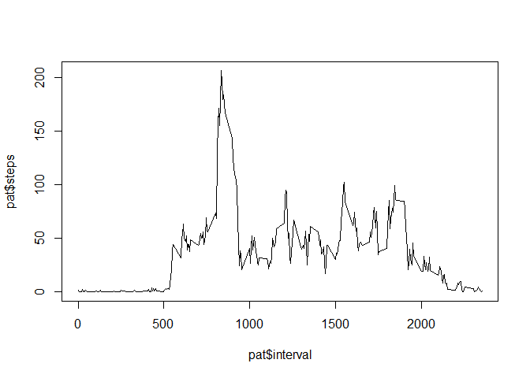
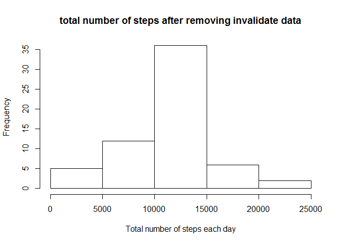
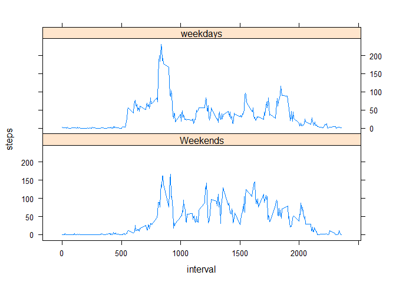

# Reproducible Research: Peer Assessment 1
Zhao Hao  


## Loading and preprocessing the data

First, we load the data from `activity.csv`, and assigne correct data types for each column. Than we check the data structure and use `reshape2` package to transform the data into a format suitable for analysis. 


```r
library("reshape2")
data <- read.csv("activity.csv", colClasses = c("numeric", "Date", "numeric"))
str(data)
```

```
## 'data.frame':	17568 obs. of  3 variables:
##  $ steps   : num  NA NA NA NA NA NA NA NA NA NA ...
##  $ date    : Date, format: "2012-10-01" "2012-10-01" ...
##  $ interval: num  0 5 10 15 20 25 30 35 40 45 ...
```

```r
mlt <- melt(data, id="date")
total <- dcast(mlt, date~variable, sum)
```

## What is mean total number of steps taken per day?

After the data preprcessing, we create a histogram plot.


```r
hist(total$steps, main="total steps each day")
```

 

The mean of the total number of steps take per day is :


```r
mean(total$steps, na.rm=T)
```

```
## [1] 10766.19
```

The median of the total number of steps take per day is :


```r
median(total$steps, na.rm=T)
```

```
## [1] 10765
```

## What is the average daily activity pattern?

Now we transform the data again according to the `interval` parameter. Then we make a time series plot of the 5-minute interval (x-axis) and the average number of steps taken, averaged across all days (y-axis)


```r
patMlt <- melt(data, id="interval", na.rm=T)
pat <- dcast(patMlt, interval ~ variable, mean)
plot(pat$interval, pat$steps, type="l")
```

 

To find out which 5-minute interval, on average across all the days in the dataset, contains the maximum number of steps we use this sentence:


```r
pat[pat$steps == max(pat$steps),1]
```

```
## [1] 835
```

## Imputing missing values

There are many days/intervals where there are missing `NA` values. The presence of missing days may introduce bias into some calculations or summaries of the data. Here is the total number of missling values:


```r
sum(is.na(data$steps))
```

```
## [1] 2304
```

Now we fill in the all the missing `steps` values with the mean data we calculated in the last step, `pat$steps`. Since the number of missing values is so greate we have to repeat the mean values to fill in the rest of the `NA`s. 


```r
newdata <- data
newdata$steps[is.na(data$steps)] <- rep(pat$steps, 61)[is.na(data$steps)]
sum(is.na(newdata$steps))
```

```
## [1] 0
```

Now we can create a new data set that is equal to the original dataset but with the missing data filled in. We then make a histogram of the total number of steps taken each day and Calculate and report the mean and median total number of steps taken per day.

The plot :


```r
newMlt <- melt(newdata, id="date")
newtotal<-dcast(newMlt, date ~ variable, sum)
hist(newtotal$steps, main = "total number of steps after removing invalidate data", xlab="Total number of steps each day")
```

 

The mean and median of the total steps are: 


```r
mean(newtotal$steps)
```

```
## [1] 10766.19
```

```r
median(newtotal$steps)
```

```
## [1] 10766.19
```

## Are there differences in activity patterns between weekdays and weekends?

To find out differences in activity patterns between weekdays and weekends, we use `weekdays()` function and `subset` the `newdata` into two datasets, one for the weekends data and one for the weekdays data.

And finally we create a panel plot containing a time series plot (i.e. type = "l") of the 5-minute interval (x-axis) and the average number of steps taken, averaged across all weekday days or weekend days (y-axis).


```r
dayData <- subset(newdata, (weekdays(date)=="Saturday" | weekdays(date)=="Sunday" ))
endData <- subset(newdata, !(weekdays(date)=="Saturday" | weekdays(date)=="Sunday" ))
dayMlt <- melt(dayData, id="interval", na.rm=T)
meanDay <- dcast(dayMlt, interval ~ variable, mean)
endMlt <- melt(endData, id="interval", na.rm=T)
meanEnd <- dcast(endMlt, interval ~ variable, mean)
meanTotal <- rbind(transform(meanDay, weekends=F), transform(meanEnd, weekends=T))
library(lattice)
with(meanTotal, xyplot(steps~interval | factor(weekends, labels=c("Weekends", "weekdays")), type = "l", layout = c(1,2)))
```

 

